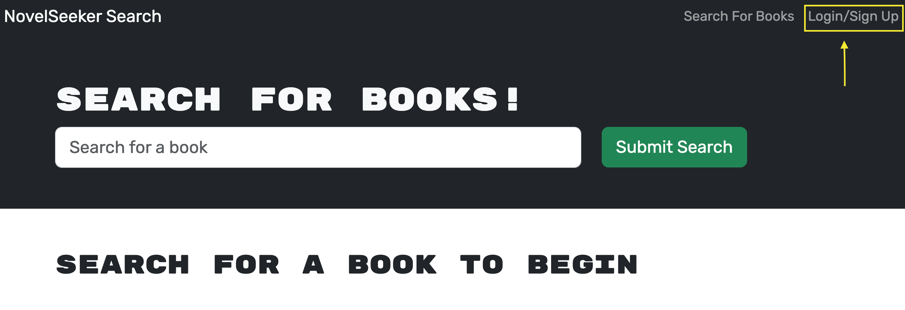
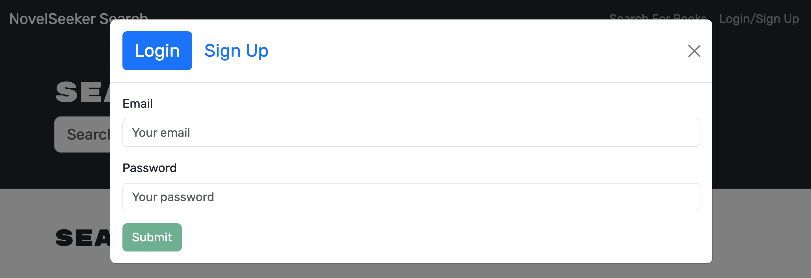
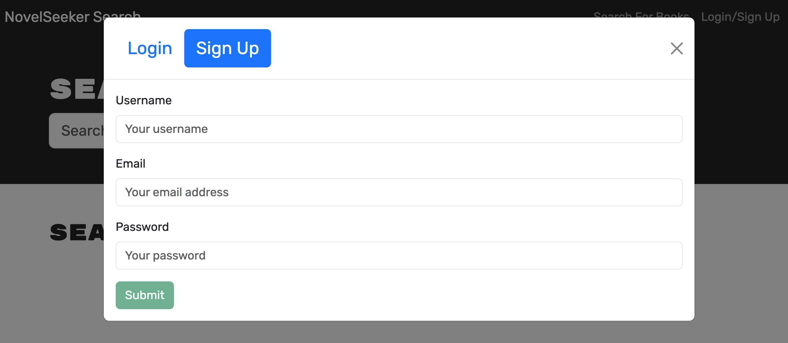
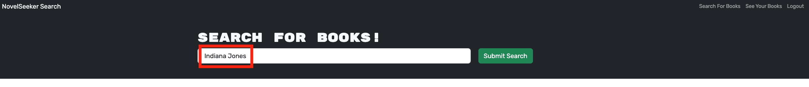
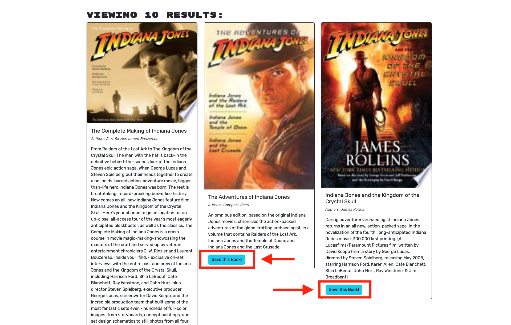
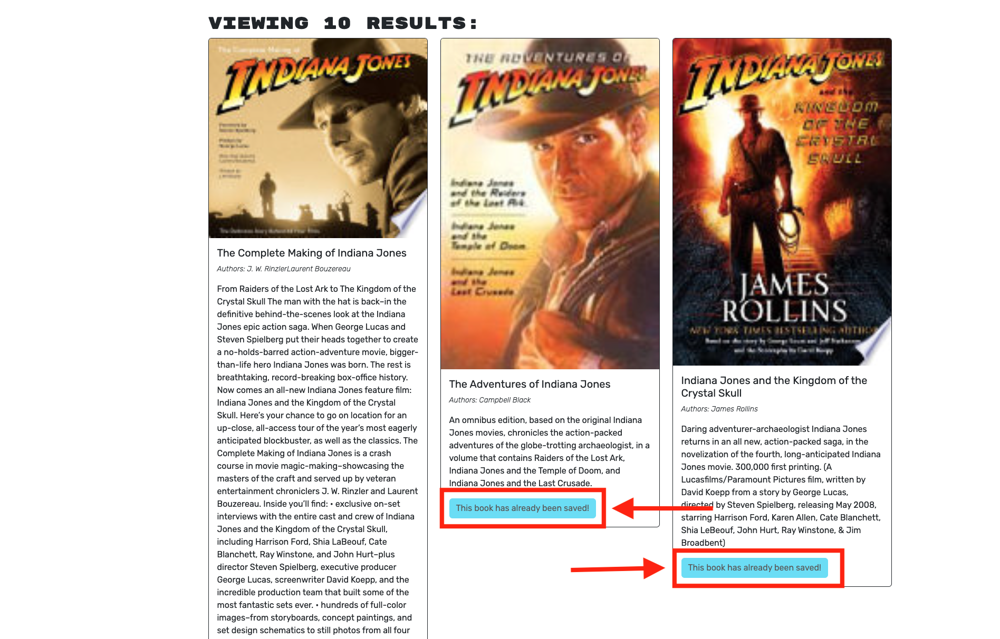
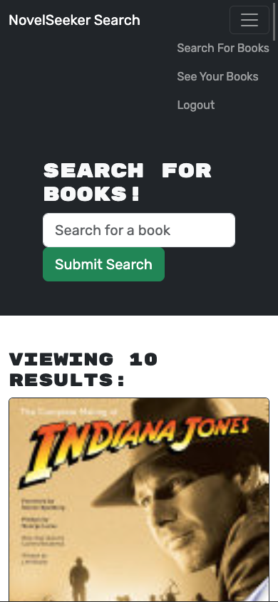

# NovelSeeker

## Overview

NovelSeeker is an innovative web application designed to simplify and enhance the experience of book enthusiasts by providing a platform to search, save, and organize their favorite novels. Leveraging the power of GraphQL, the application seamlessly integrates with the Google Books API to offer an extensive database of books.

### Key Features

- **Effortless Book Search:** Easily explore a vast collection of books using the intuitive search functionality powered by Google Books API.

- **Personal Library Management:** Create and manage a personalized library by saving your favorite books with detailed information, including authors, descriptions, and cover images.

- **User Authentication:** Securely register and log in to NovelSeeker to access personalized features, such as saving and retrieving your book collection.

- **Responsive Design:** Enjoy a user-friendly experience across various devices, ensuring accessibility whether you're on a desktop, tablet, or smartphone.

### Purpose

NovelSeeker is crafted with the purpose of providing a centralized hub for book enthusiasts to discover, organize, and keep track of their favorite novels effortlessly. Whether you're an avid reader or just getting started, NovelSeeker simplifies the process of finding and cataloging books, making the literary journey enjoyable and organized. Explore, save, and rediscover the joy of reading with NovelSeeker.

## Table of Contents

- [Description](#description)
- [Tools](#tools)
- [Technology Stack](#technology-stack)
- [Installation](#installation)
- [Usage](#usage)
- [Testing](#testing)
- [Links](#links)
- [Credits](#credits)
- [Contributing](#contributing)
- [Report Issue](#report-issue)

## Description

NovelSeeker is a web application designed to cater to the needs of book enthusiasts, offering a solution to the common challenge of managing and exploring a diverse collection of books. The application seamlessly integrates with the Google Books API, providing users with a convenient platform to search for, save, and organize their favorite novels.

### What is it about?

NovelSeeker revolves around simplifying the process of discovering and managing books. It acts as a bridge between users and the extensive Google Books database, allowing them to explore a wide range of titles, authors, and genres.

### What problem does it solve?

For avid readers and book collectors, keeping track of a growing library can be challenging. NovelSeeker addresses this problem by providing a user-friendly interface for searching, saving, and categorizing books. It aims to enhance the reading experience by offering a centralized platform where users can curate their personalized libraries.

NovelSeeker also tackles the need for a secure and personalized space. Through user authentication, the platform ensures that users can not only explore but also save and retrieve their book collections securely.

In summary, NovelSeeker seeks to streamline the way book enthusiasts interact with their literary world, offering an organized and accessible platform for an enhanced reading experience.

[Top](#novelseeker) | [Table of Contents](#table-of-contents)

## Tools

- **Node.js (JavaScript Runtime):** A robust server-side JavaScript runtime that enables the execution of server-side code, providing the foundation for NovelSeeker's backend functionality.

- **npm (Node Package Manager):** As the package manager for Node.js, npm simplifies the management of project dependencies, ensuring a smooth integration of libraries and packages that NovelSeeker relies on.

- **Git (Version Control System):** Git serves as the version control system for NovelSeeker, enabling efficient tracking of code changes, collaboration among developers, and the ability to revert to previous states. This ensures a well-organized and collaborative development process.

[Top](#novelseeker) | [Table of Contents](#table-of-contents)

## Technology Stack

NovelSeeker leverages a robust and versatile technology stack to ensure efficient development and seamless functionality across its server and client components.

### Root Package.json

#### Project Commands/Scripts

- **start:** Initiates the server using `node server/server.js`.
- **develop:** Concurrently runs server and client development environments.
- **install:** Install server and client dependencies.
- **build:** Compiles the client using `npm run build`.

#### Dev Dependencies

- **concurrently:** ^8.2.0
  - Facilitates the concurrent execution of multiple commands during development.

### Server Package.json

#### Project Commands/Scripts

- **test:** Launches the server using `node server.js`.
- **watch:** Operates the server using nodemon for automatic restarts.

#### Dependencies

- **@apollo/server:** ^4.9.5

  - Implements a GraphQL server for defining schemas and resolving queries. Used for server-side testing.

- **apollo-server-express:** ^3.6.2

  - Integrates Apollo Server with Express for GraphQL with Express as the HTTP server.

- **bcrypt:** ^5.0.0

  - Library for hashing passwords, commonly used for secure password storage.

- **dotenv:** ^16.3.1

  - Loads environment variables from a .env file into process.env, aiding in configuration management during development.

- **express:** ^4.17.2

  - Fast and minimalist webb framework for Node.js, simplifying building robust web applications.

- **graphql:** ^16.6.0

  - Query language and runtime for APIs, often used with Apollo Server for GraphQL.

- **jsonwebtoken:** ^9.0.2

  - Generates and verifies JSON Web Tokens (JWT) for user authentication and authorization.

- **mongoose:** ^7.0.2

  - Object Data Modeling (ODM) library for MongoDB and Node.js, providing schema-based data modeling.

#### Dev Dependencies

- **nodemon:** ^2.0.3

  - Utility that monitors changes in Node.js applications and automatically restarts the server during development.

### Client Package.json

#### Project Commands/Scripts

- **dev:** Run Vite for development.
- **build:** Build the client using Vite.
- **lint:** Run ESLint for linting.
- **preview:** Preview the client using Vite.

#### Dependencies

- **@apollo/client:** ^3.7.14

  - Client library for interacting with a GraphQL server, facilitating queries and mutations.

- **bootstrap:** ^5.2.3

  - Front-end framework for responsive and visually appealing designs.

- **graphql:** ^16.6.0

  - Query language and runtime for APIs, commonly used with Apollo Client for GraphQL.

- **jwt-decode:** ^3.1.2

  - Library for decoding JSON Web Tokens (JWT) on the client side, useful for authentication.

- **react:** ^18.2.0

  - JavaScript library for building user interfaces and managing application state.

- **react-bootstrap:** ^2.7.4

  - React implementation of the Bootstrap framework, offering pre-designed components.

- **react-dom:** ^18.2.0

  - Entry point for the React DOM library, enabling rendering React components in the browser.

- **react-router-dom:** ^6.11.2

  - Library for adding routing functionality to React applications.

#### Dev Dependencies

- **@types/react:** ^18.0.28

  - Type definitions for React, enhancing development with type information and autocompletion.

- **@types/react-dom:** ^18.0.11

  - Type definitions for React DOM, providing type information for React DOM-specific features.

- **@vitejs/plugin-react:** ^4.0.0

  - Vite plugin enabling React support, particularly useful for fast development with features like hot module replacement.

- **eslint:** ^8.38.0

  - Tool for identifying and fixing problems in JavaScript code, ensuring code quality and consistency.

- **eslint-plugin-react:** ^7.32.2

  - ESLint plugin for React, providing rules and configurations for best practices.

- **eslint-plugin-react-hooks:** ^4.6.0

  - ESLint plugin enforcing rules related to React Hooks usage.

- **eslint-plugin-react-refresh:** ^0.3.4

  - ESLint plugin related to React Refresh, providing rules for faster development.

- **vite:** ^4.3.2

  - Fast build tool for modern web development, particularly effective for React projects with features like lightning-fast hot module replacement.

[Top](#novelseeker) | [Table of Contents](#table-of-contents)

## Installation

### Prerequisites

Before proceeding with the installation, make sure to have the following prerequisites installed in your system:

1. **Node.js and npm:** Ensure that Node.js and npm are installed. Download and install them from Node.js [official website](https://nodejs.org/en).

2. **MongoDB:** This project uses MongoDB as the database, make sure to have MongoDB installed and running. Download MongoDB from the [official website](https://www.mongodb.com/try/download/community).

### Step-by-Step Instructions

Follow these step-by-step instructions to set up NovelSeeker on your local machine:

1. **Clone the Repository:**

   Open your terminal and run the following command to clone the NovelSeeker repository:

   ```
   git clone git@github.com:Clkwong3/NovelSeeker.git
   ```

2. **Install Dependencies:**

   - Navigate into the server directory using the terminal:

     ```
     cd NovelSeeker/server
     ```

   - Install server dependencies:

     ```
     npm install
     ```

   - Move back to the root directory and navigate into the client directory:

     ```
     cd ../client
     ```

   - Install client dependencies:
     ```
     npm install
     ```

3. **Configure Database Connection:**

   - Open the `server/config/connection.js` file in your preferred code editor.

   - Adjust the MongoDB connection URI as needed to match your local MongoDB setup.

   - Create a `.env` file in the `server` directory for storing sensitive information. Add the following:

     ```env
     SECRET_KEY=your_secret_key
     ```

     Replace `your_secret_key` with your actual secret key.

   - In `server/utils/auth.js`, access the secret key using the `process.env`:

     ```javascript
     const jwt = require("jsonwebtoken");
     require("dotenv").config();

     function generateToken(user) {
       return jwt.sign(
         { id: user._id, username: user.username },
         process.env.SECRET_KEY,
         {
           expiresIn: "1h",
         }
       );
     }

     module.exports = generateToken;
     ```

4. **Run the Project:**

   - To start the server, run the following command from the server directory:

     ```
     cd NovelSeeker/server
     npm start
     ```

   - To launch the client, run the following command from the client directory:

     ```
     cd NovelSeeker/client
     npm run dev
     ```

   - If you want to run both the server and client concurrently, use the following command from the root directory:
     ```
     npm run develop
     ```

Now, NovelSeeker should be up and running on your local machine. Access it through your preferred web browser and start exploring and managing your favorite novels!

[Top](#novelseeker) | [Table of Contents](#table-of-contents)

## Usage

NovelSeeker simplifies the process of discovering, saving, and organizing your favorite novels. Follow these steps to effectively use the application:

1.  **User Authentication:**

    - For a personalized experience, sign up or log in to NovelSeeker using the "Login/Sign Up" button.
    - Authentication ensures secure access to your saved book collection across sessions.

    **Click Here:**
    

    **Login:**
    

    **Sign Up:**
    

2.  **Explore Books:**

    - Use the search bar to explore a vast collection of books powered by the Google Books API.
    - Enter keywords, titles, authors, or genres to find books that match your interests.
      

3.  **Save Favorites:**

    - Upon finding a book of interest, click the "Save This Book!" button to add the book to your personalized library.

    **Before:**
    

    **After:**
    

4.  **Manage Your Library:**

    - Navigate to the "See Your Books" section to access your saved books.
      

    - Here, you can view and remove books from your library.
      

5.  **Responsive Design:**

    - Enjoy a seamless experience on various devices, including desktops, tablets, and smartphones.

      **iPhone Pro:**

      

      **Samsung Galaxy:**

      

[Top](#novelseeker) | [Table of Contents](#table-of-contents)

## Testing

### Server-Side Testing

NovelSeeker emphasizes testing on the server side using Apollo Server to ensure the reliability and functionality of its GraphQL implementation. Follow these steps to run the server-side tests:

#### Prerequisites

Ensure that all project dependencies are installed by following the [Installation](#installation) instructions.

#### Running Server-Side Tests

1. Open your terminal.
2. Navigate to the `server` directory:

   ```
   cd NovelSeeker/server
   ```

3. Run the following command to test the back-end code on the sandbox:
   ```
   npm test
   ```

#### Testing Details

The server-side tests cover aspects such as:

- **GraphQL Schema:** Ensure that the GraphQL schema is correctly defined and follows the specified structure.

- **Resolvers:** Validate the functionality of GraphQL resolvers, including proper data fetching and response handling.

- **Authentication:** Verify the authentication logic, ensuring secure access to specific features.

Feel free to contribute additional tests or enhance existing ones to improve the overall test coverage of the server-side functionality in NovelSeeker.

[Top](#novelseeker) | [Table of Contents](#table-of-contents)

## Links
Here is a small collection of helpful links that helped my understanding of GraphQL, covering topics from Apollo Server documentation to in-depth tutorials on building schemas and refactoring practices. You will also find YouTube playlists on GraphQL, JWT authentication, and a live demo of the NovelSeeker project deployed on Heroku for practical insights.

### GraphQL Tutorials

- **Apollo Server Docs:**
  - [Resolvers](https://www.apollographql.com/docs/apollo-server/data/resolvers/) - Learn about GraphQL resolvers and how they handle data fetching.
  - [Building a Schema](https://www.apollographql.com/tutorials/fullstack-quickstart/02-building-a-schema) - Follow a tutorial on building a GraphQL schema for a full-stack application.

- **GraphQL Docs:**
  - [Schemas and Types](https://graphql.org/learn/schema/) - Explore the basics of GraphQL schemas and types.

- **Blogs and Articles:**
  - [Refactor Schemas](https://www.moonhighway.com/articles/refactoring-graphql-schemas/) - Read about best practices for refactoring GraphQL schemas.
  - [From REST to GraphQL](https://blog.christophervachon.com/from-rest-to-graphql-part-1/) - Understand the transition from REST APIs to GraphQL.
  - [Migrate from REST APIs to GraphQL](https://blog.bitsrc.io/migrating-existing-rest-apis-to-graphql-2c5de3db647d) - Get insights on migrating existing REST APIs to GraphQL.
  - [Authentication and Authorization in GraphQL](https://daily.dev/blog/authentication-and-authorization-in-graphql) - Explore authentication and authorization practices in GraphQL.

### YouTube Tutorials

- **GraphQL:**
  - [Beginner to Expert](https://www.youtube.com/playlist?list=PLpPqplz6dKxXICtNgHY1tiCPau_AwWAJU) - A comprehensive playlist for beginners to experts in GraphQL.
  - [GraphQL Tutorial](https://www.youtube.com/playlist?list=PL4cUxeGkcC9iK6Qhn-QLcXCXPQUov1U7f) - Follow a tutorial on GraphQL.
  - [GraphQL Tutorial Updated](https://www.youtube.com/playlist?list=PL4cUxeGkcC9gUxtblNUahcsg0WLxmrK_y) - An updated version of the GraphQL tutorial.

- **JWT:**
  - [Playlist for JWT](https://www.youtube.com/playlist?list=PL4cUxeGkcC9g8OhpOZxNdhXggFz2lOuCT) - Explore JSON Web Tokens (JWT) in this playlist.
  - [JWT Authentication](https://www.youtube.com/watch?v=enopDSs3DRw) - Learn about JWT authentication with Traversy Media.
  - [MERN Stack Tutorial](https://www.youtube.com/watch?v=Ejg7es3ba2k) - A tutorial covering the MERN (MongoDB, Express.js, React, Node.js) stack.

### Project Demo

- [Heroku Deployment](https://warm-beyond-71834-7ceb3704c7cf.herokuapp.com/) - Explore the live demo of the NovelSeeker project on Heroku.


[Top](#novelseeker) | [Table of Contents](#table-of-contents)

## Credits

This project was developed by [Clarice Kwong](https://github.com/Clkwong3).

**Code Attribution:**

I want to recognize that certain elements of this project were derived from a class activity, specifically Activity 25 - 26: Stu_Resolver-Context within Module 21-MERN. The class materials and discussions significantly contributed to shaping the development and design of the project.

**Tutoring Session Influence:**

I would like to extend my appreciation for the valuable guidance and insights received during tutoring sessions. These sessions played a crucial role in offering solutions, recommending enhancements, and influencing certain aspects of the project's development.

[Top](#novelseeker) | [Table of Contents](#table-of-contents)

## Contributing

If you'd like to contribute to the project with code or other contributions, here's how you can get started:

1. **Fork the Repository:** Start by forking the project's repository to your GitHub account.

2. **Clone the Repository:** Clone your forked repository to your local development environment.

   ```
   git clone git@github.com:Clkwong3/NovelSeeker.git
   ```

3. **Create a New Branch:** Create a new branch for your contribution.

   ```
   git checkout -b feature/your-feature-name
   ```

4. **Make Changes:** Make your desired changes or contributions.

5. **Test Your Changes:** Ensure that your changes do not introduce any new issues and pass all existing tests.

6. **Commit Your Changes:** Commit your changes with a clear and concise commit message.

   ```
   git commit -m "Add feature: your feature description"
   ```

7. **Push to Your Repository:** Push your changes to your forked repository.

   ```
   git push origin feature/your-feature-name
   ```

8. **Create a Pull Request:** Go to the project's [Pull Requests](https://github.com/Clkwong3/NovelSeeker/pulls) page, and click on "New Pull Request."

9. **Select the Base Branch:** Choose the appropriate base branch, typically the main branch of the project.

10. **Review and Submit:** Review your changes, provide a clear description of your contribution, and submit the pull request.

The project creator will review your pull request and provide feedback.

Thank you for your interest in contributing to the project!

[Top](#novelseeker) | [Table of Contents](#table-of-contents)

## Report Issue

If you encounter any issues in the project, here's how you can get involved:

**Reporting Issues**

1. **GitHub Issues:** Visit the project's [GitHub Issues](https://github.com/Clkwong3/NovelSeeker/issues) page.

2. **Search for Existing Issues:** Before creating a new issue, please search for existing ones to check if your concern has already been addressed.

3. **Create a New Issue:** If your issue isn't already listed, click on the "New Issue" button.

4. **Issue Title:** Use a descriptive and concise title that summarizes the problem.

5. **Issue Description:** In the issue description, provide the following details:

   - A clear and detailed explanation of the issue.
   - Steps to reproduce the problem if applicable.
   - Information about your environment, such as your operating system and any relevant software versions.

6. **Screenshots or Error Messages:** If you have visual aids, such as screenshots or error messages, please attach them to the issue.

7. **Labeling:** If you're familiar with labels or the issue tracking system on GitHub, you can add labels that best describe the issue. If not, don't worry; we'll handle that.

8. **Submit the Issue:** Click "Submit new issue," and the project creator will review it. We'll get back to you as soon as possible.

[Top](#novelseeker) | [Table of Contents](#table-of-contents)
